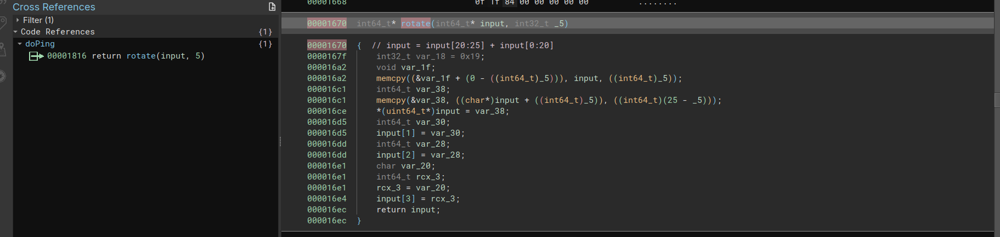
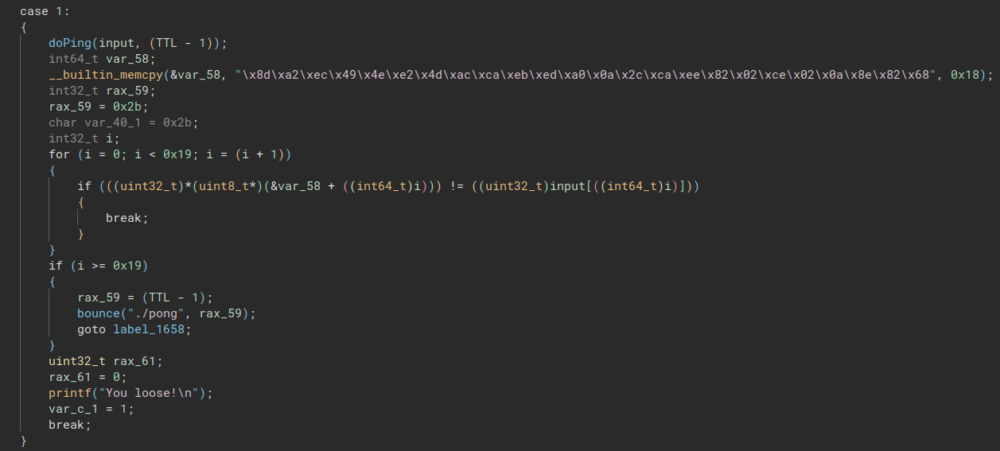

# Ping Pong

## Game

The challenge consists in two binaries sending data to each other.

By analyzing the ping binary we can see that one argument is required, and is must be 25 character long and the len must be odd.

Then we observe that the last character of the input is get if the TTL environnement variable is not set.

## Set

The switch case works with current TTL and input. In fact both binaries act this way:

 1 - Get TTL
 2 - Get argv[1]
 3 - Decrement TTL
 4 - Do magic with input and TTL
 5 - Call other binary with new TTL and new input

 Theses actions are performed with a base TTL of 25.

## Match

Let's check what the 4 point above do

### Ping

In the ping binary, the "doPong" function do three operations: 
 - xor the input with the TTL
 - linear operation on the result
 - rotate the new result

 The linear operation do the following: 

```C
00001750  {
00001754      uint64_t rax;
00001754      rax = r;
0000175b      char r = rax;
00001769      for (int32_t ctr = 0; ctr < 0x19; ctr = rax)
000017c7      {
000017be          input[((int64_t)ctr)] = (((int8_t)(((uint32_t)input[((int64_t)ctr)]) >> r)) + ((int8_t)((((uint32_t)input[((int64_t)ctr)]) & ((1 << r) - 1)) << (8 - r))));
000017c4          rax = ((uint64_t)(ctr + 1));
000017c4      }
000017d0      return rax;
000017d0  }

```

With some clean:

```C
for(ctr = 0; ctr <25 ; ctr++){
    input[ctr] = (input[ctr] >> r) + (input[ctr]) & ((1 << r) - 1) << (8 - r);
}
```

To invert this linear operation, all you have to do is to do the same thing with (8-r) as argument.
For example in python:
```python
>>> def transfo(n,r):
...     return((n >> r) + ((n & (2**r -1)) << (8-r)))
... 
>>> transfo(156,7)
57
>>> transfo(57,1)
156
``` 


Then a rotation is performed on the buffer:



The five las characters are placed at the begining and the rest after.

### Pong

Pong binary performs one more operation:
 - xor the input with the TTL
 - linear operation on the result
 - xor again input with a constant
 - rotate the new result

The linear operation is the same as in ping, but with different constant.
The rotation is different, here it put the five first characters at the end, from 13th to the end at the begining and insert the rest between.

## Smash !

When TTL reach 1, pong do the final verification: 



Putting all this together, we can revert the linear operations and xor from the checked result:

[solve.py](solve.py)
```python
base = [141, 162, 236, 73, 78, 226, 77, 172, 202, 235, 237, 160, 10, 44, 202, 238, 130, 2, 206, 2, 10, 142, 130, 104, 43]

def unpingrot(s):
    return s[-5:]+s[:20]

def unpongrot(s):
    return s[-5:]+s[-13:-5]+s[:12]

def xor(s,TTL):
    return [i ^ TTL for i in s]

def transfo(n,r): #  ((str[i] >> r) + ((str[i]  & ((1 << r) -1)) << (8-r)))
    return((n >> r) + ((n & (2**r -1)) << (8-r)))

def unping(s,TTL):
    t = unpingrot(s)
    u = [transfo(i,5) for i in t]
    v = xor(u,TTL)
    return v

def unpong(s,TTL):
    t = unpongrot(s)
    u = xor(t,6)
    v = [transfo(i,1) for i in u]
    w = xor(v,TTL)
    return w

s = base
for i in range(0,25,2):
    s = unping(s,i)
    print("".join(chr(x) for x in s))
    s = unpong(s,i+1)
    #print("".join(chr(x) for x in s))
```