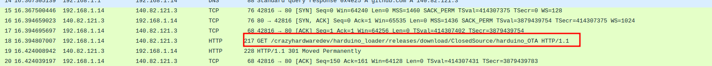
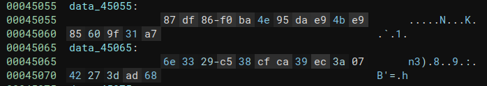
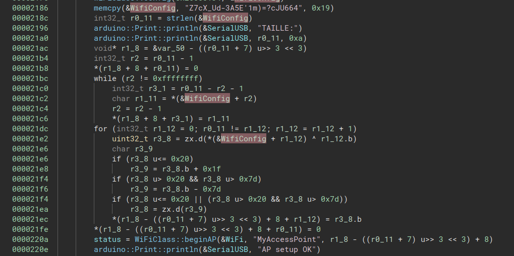

# Harduino

The challenge is about reversing two binaries: 
 - A rust binary performing cipher and sending data over TCP
 - An ARM compiled binary targeting an Arduino nano IoT 33

A [network capture](#) was given.

# Solve
## Network capture analysis

Opening the capture, a github link is identified: 



From this information, we can download [the binary](https://github.com/crazyhardwaredev/harduino_loader/releases/download/ClosedSource/harduino_OTA) used to perform the firmware update.

## Github commits

This step is not really mandatory to solve the challenge but is given as an helper. 

The [original source code](https://github.com/crazyhardwaredev/harduino_loader/commit/91c274d2698739af0cfaf86fa38914586d16f416) can be retrived from commits.

## Reversing the loader

The rust binary is not stripped. We can identify what is done during execution.
If you retrived the source code, you can compile it and compare the main functions to understand where are the real key and IV.



It is now possible to extract and decrypt the firmware. 

## Extraction and decryption

From wireshark (or tshark for CLI lovers), you can extract the [TCP stream of the encrypted firmware](./encrypted_firmware)

You can use the given rust source code to decrypt it, or use your [best python skillz](./decrypt.py) and obtain the [decrypted frimware](./decrypted_firmware)

```bash
[ghozt@maze Harduino]$ file decrypted_firmware 
decrypted_firmware: ELF 32-bit LSB executable, ARM, EABI5 version 1 (SYSV), statically linked, with debug_info, not stripped
```
## Reversing the firmware 

The firmware is setting up a WiFi AP on the arduino, and also setup a webverser on port 80 with IP address 192.168.2.42.


The WiFi passphrase is then "obfuscated".



The algoritm has two parts.

First, the base string is reversed, the, a new loop xor each byte with the counter. Then, the result is added with 31 or sub with 126, this is just an ugly trick to ensure the character is printable.

Anyway, the reversed string is not used in the code, it act as dead code.

You can retrieve the key with a [python script](./getKey.py) for example.

Once authenticated to the AP, a simple access to the web server give you the flag

Hope you enjoyed the challenge ;)


